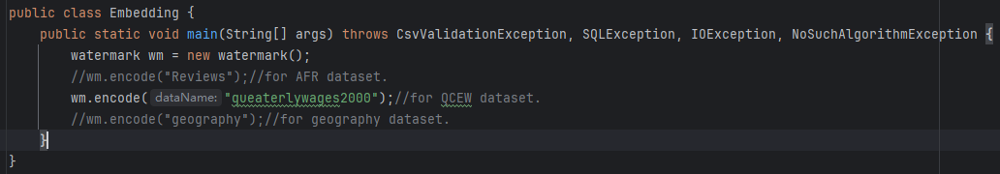
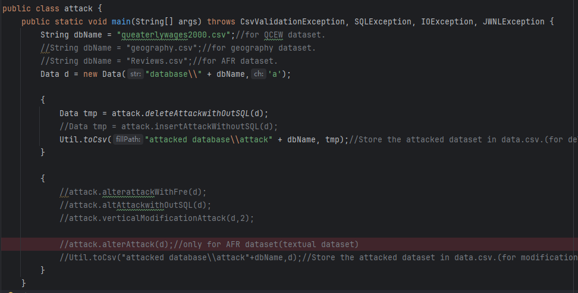
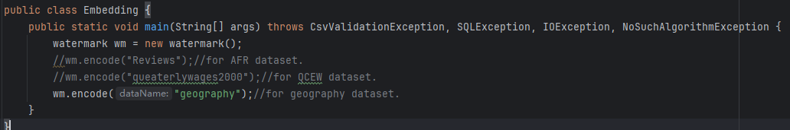
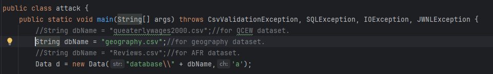
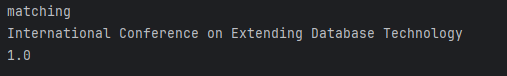

# **A zero-distortion robust database watermarking scheme (PhiMark)**

## Contents

- [Introduction](#introduction)
- [Features](#features)
- [PRELIMINARIES](#preliminaries)
- [Module Overview](#module overview)
- [Getting started](#getting started)

## Introduction

PhiMark is a zero-distortion robust database watermarking technique designed to provide copyright protection for datasets where any modification is strictly prohibited. It ensures that embedding watermarks does not affect the accuracy or availability of the data, making it suitable for high-accuracy applications such as governmental applications, medical applications, etc.

## Features

- ***Zero-distortion:*** PhiMark embeds watermarks by extracting features and generating a mask for each partition, without making any modifications to the original data,  preserving full availability.  To our knowledge, PhiMark is the first scheme to truly achieve zero-distortion robust database watermarking.

- ***Broader applicability:*** PhiMark does not depend on primary keys and is compatible with both textual and numerical data. Compared with traditional schemes, PhiMark is adapted to broader application scenarios.

- ***Automated parameter tuning:*** Unlike traditional robust watermarking schemes, PhiMark abandons the costly manual parameter tuning and introduces a genetic algorithm with a carefully designed fitness function, achieving efficient automated parameter adjustment.

## PRELIMINARIES

Before using this project, ensure that your environment meets the following requirements:

- **JDK11** or higher version
  
  - You can check your JDK version by running the following command:
    
    ```bash
     java -version
    ```
    
    If JDK 11 is not installed, download it from [here](https://www.oracle.com/java/technologies/downloads/#java11).

- **Maven3.9.6** or higher version
  
  - You can check your Maven version by running the following command:
    
    ```bash
     mvn -v
    ```
    
    If Maven is not installed, download and install it from the official [Maven website](https://maven.apache.org/download.cgi).

## Module overview

1. **Data.java:** Read datasets from CSV files and store the data along with relevant information. The dataset is read from a CSV file for simplicity, but any readable structured data format, such as SQL or other similar formats, can be used.

2. **Util.java:** a utility class that contains some general methods.

3. **genetics.java:** Parameter optimization through a genetic algorithm.

4. **watermark.java:** Including the core algorithms for watermark embedding and extraction.

5. **Embedding.java:** Implementing watermark embedding.

6. **attack.java:** Simulating common malicious attacks on the dataset.

7. **Extraction.java:** Implementing watermark extraction.

8. **Merge.java**: Preparing the test dataset.

   

## Getting started

###### Maven configuration

To set up the project, ensure that your `pom.xml` file includes the necessary dependencies.  You can add the following dependencies in your `pom.xml`. If you do not intend to test modification attacks on text databases (which require synonym substitution), please remove the three marked dependencies in `pom.xml` ,delete the corresponding synonym-based alteration attack code, and then skip directly to the [Dataset Preparation](#dataset-preparation).

```pom.xml
<project xmlns="http://maven.apache.org/POM/4.0.0" xmlns:xsi="http://www.w3.org/2001/XMLSchema-instance"
         xsi:schemaLocation="http://maven.apache.org/POM/4.0.0 http://maven.apache.org/xsd/maven-4.0.0.xsd">
    <modelVersion>4.0.0</modelVersion>

    <groupId>org.example</groupId>
    <artifactId>watermark</artifactId>
    <version>1.0-SNAPSHOT</version>
    <packaging>jar</packaging>

    <name>watermark</name>
    <url>http://maven.apache.org</url>

    <properties>
        <project.build.sourceEncoding>UTF-8</project.build.sourceEncoding>
    </properties>

    <dependencies>
        <dependency>
            <groupId>junit</groupId>
            <artifactId>junit</artifactId>
            <version>3.8.1</version>
            <scope>test</scope>
        </dependency>

        <!-- OpenCSV: A library for reading and writing CSV files in Java -->
        <dependency>
            <groupId>com.opencsv</groupId>
            <artifactId>opencsv</artifactId>
            <version>5.0</version>
        </dependency>
        <!-- Jenetics: A Java genetic algorithm library -->
        <dependency>
            <groupId>io.jenetics</groupId>
            <artifactId>jenetics</artifactId>
            <version>4.3.0</version>
        </dependency>
        <!-- MySQL JDBC Driver: Used for connecting the application to a MySQL database -->
        <dependency>
            <groupId>mysql</groupId>
            <artifactId>mysql-connector-java</artifactId>
            <version>8.0.21</version>
        </dependency>
        <dependency>
            <groupId>junit</groupId>
            <artifactId>junit</artifactId>
            <version>RELEASE</version>
            <scope>compile</scope>
        </dependency>

        <!-- FastJSON: A high-performance JSON parser and serializer for Java -->
        <dependency>
            <groupId>com.alibaba</groupId>
            <artifactId>fastjson</artifactId>
            <version>1.2.47</version>
        </dependency>
        
         <!-- The following dependencies are only required when testing on text-based datasets. -->
        <dependency>
            <groupId>net.sf.jwnl</groupId>
            <artifactId>jwnl</artifactId>
            <version>1.4.1-rc2</version>
        </dependency>

       <dependency>
            <groupId>com.example</groupId>
            <artifactId>ws4j</artifactId>
            <version>1.0.1</version>
       </dependency>

       <dependency>
            <groupId>org.apache.opennlp</groupId>
            <artifactId>opennlp-tools</artifactId>
            <version>2.1.0</version>
       </dependency>
    </dependencies>
    <build>
        <plugins>
            <plugin>
                <groupId>org.apache.maven.plugins</groupId>
                <artifactId>maven-compiler-plugin</artifactId>
                <version>3.8.0</version>
                <configuration>
                    <source>8</source>
                    <target>8</target>
                </configuration>
            </plugin>
        </plugins>
    </build>
</project>
```

Since the Maven repository does not include `jwnl` and `ws4j`, you need to install them manually.  
We provide the required JAR files: `jwnl.jar` and `ws4j-1.0.1.jar`.  
After downloading them, follow the commands below in the project directory to install them:

```
mvn install:install-file -DgroupId="net.sf.jwnl" -DartifactId="jwnl" -Dversion="1.4.1-rc2" -Dpackaging="jar" -Dfile="yourpath\jwnl.jar"
```

```
mvn install:install-file -DgroupId=“com.example” -DartifactId=“ws4j” -Dversion=“1.0.1” -Dpackaging=“jar” -Dfile="yourpath\ws4j-1.0.1.jar"
```


###### Dataset preparation

Due to GitHub's 25MB limit for individual files, we have split the dataset during upload. Before running the project, the datasets need to be merged and placed in the `database` folder. Please ensure the merged files are named `geography.csv` ,`quarterlywages2000.csv`   and `Reviews.csv`, respectively. Among them, `geography.csv` and `quarterlywages2000.csv` are used for numerical experiments, while `Reviews.csv` is used for textual experiments. The dataset merging script is located at `src\main\java\Merge\merge.java`.


###### Running the Project

We conducted experiments using two datasets: the QCEW dataset and the geography dataset. First, we will describe the watermarking process using the QCEW dataset as an example. Finally, we will explain how to switch to the geography dataset for testing. Both datasets are located in the `database` folder.

1. *Embedding watermarks:* First, run the `main` function of `Embedding.java` to embed watermarks into the dataset.
   
   
   
   After the embedding process is completed, the generated verification information file, `"queaterlywages2000veriInfo.json"`, can be found in the `"veri Information"` folder. The information is stored in JSON format.
   
   
   
   
   
   Note: Storing information in a `.json` file is merely for experimental convenience; in practice, we prefer to store such information in database tables.

2. *Simulating malicious attacks:*  Run the `main` function of `attack.java` allows for simulating malicious attacks on the dataset. The deletion and addition attacks generate a new `Data` object called `tmp`, while the remaining attacks modify the original `Data` object d directly.
   
   
   
   The attacked dataset can be found in the 'attacked database' folder.
   
   

3. *Extracting the watermark:* run the `main` function of `Extraction.class` on the attacked dataset, which will output the Watermark Match Rate (WMR).
   
   

###### Supplementary Notes

- Switch to the `geography` dataset
  
  Simply modify the relevant code, as shown in the figure below, to adapt it for the geography dataset.
  
  **Embedding.java** 
  
  
  
  **attack.java** 
  
  
  
  **Extraction.java** 
  
  

- Using meaningful watermarks
  
  PhiMark can also use a meaningful string as a watermark, allowing the extracted watermark to determine data ownership directly.
  
  
  
  Extraction Result.
  
  
